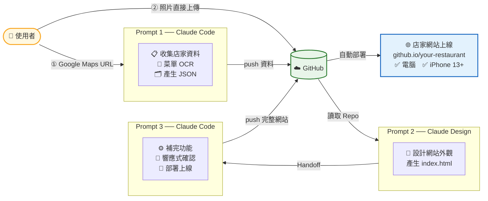
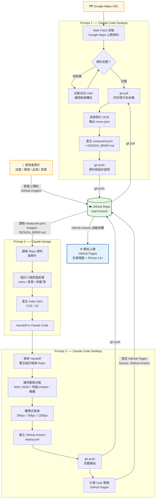

# Interactive Prompts to make a website of any public commercial place

## Prompts

1. Prompt 1 is for Claude Code Desktop
2. Prompt 2 is for Claude Design
3. Prompt 3 is for Claude Code Desktop again

## Notes

- All images files shall be uploaded to GitHub repo directly. Do not let Claude Code to upload the images.
- Make sure images are small enough to be stored on GitHub

## 網站產生器流程

### 簡版流程圖

### 細部分解

## 節點說明

| 顏色 | 代表 |
|------|------|
| 黃色 | 外部輸入（Google Maps URL、使用者照片） |
| 綠色 | GitHub Repo（三個階段的唯一交接媒介） |
| 藍色 | 最終成果（GitHub Pages 網站） |
| 灰色 | 各階段的處理步驟 |

## 照片上傳說明

使用者照片**直接上傳到 GitHub Repo 的 `images/` 目錄**，
不經過 Claude Code 對話。Claude Code 在第四步執行 `git pull` 同步後才讀取照片。

| 資料夾 | 用途 |
|--------|------|
| `images/exterior/` | 店面外觀照 |
| `images/interior/` | 室內環境照 |
| `images/dishes/` | 招牌品項照 |
| `images/menu/` | 菜單照片（供 OCR 辨識） |

## 階段說明

| 階段 | 工具 | 主要任務 |
|------|------|---------|
| Prompt 1 | Claude Code Desktop | 資料收集、git pull 同步照片、菜單 OCR、push 到 GitHub |
| Prompt 2 | Claude Design | 讀取 Repo、設計網站、Handoff to Claude Code |
| Prompt 3 | Claude Code Desktop | 整合設計稿、補完功能、響應式檢查、部署上線 |
